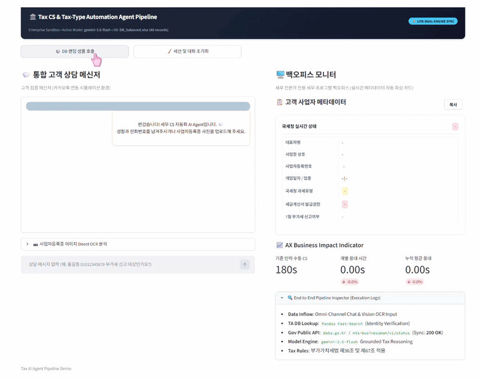
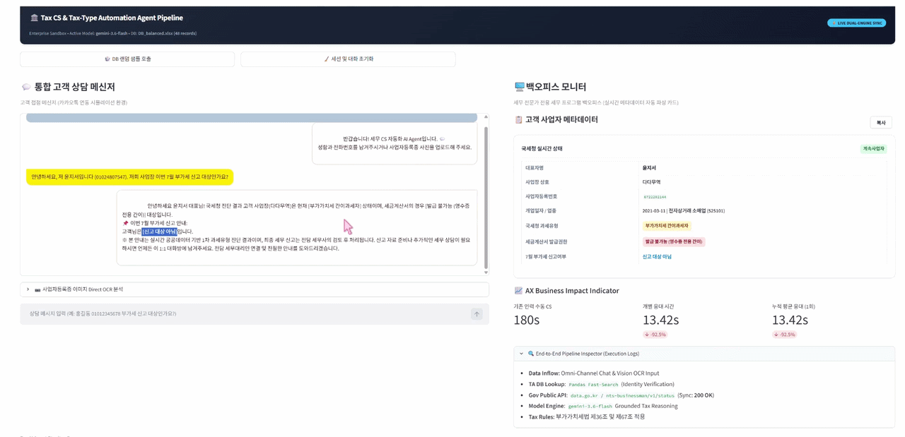
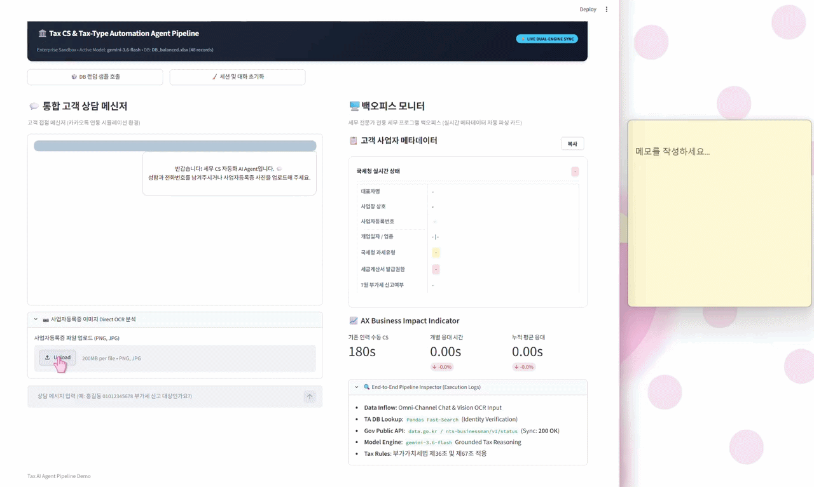

# 🏛️ Tax CS & Tax-Type Automation Agent Pipeline
> **세무 CS 인바운드 자동화 및 국세청 API 기반 실시간 과세유형 판별 AI Agent 파이프라인**  
> *AX Advisory & AI Product Portfolio for Big 4 Accounting Firms*

[](https://www.python.org/)
[](https://streamlit.io/)
[](https://ai.google.dev/)
[](https://www.data.go.kr/)

---

## 🎬 Live Product Demos & Core Workflows

| 1️⃣ End-to-End 실시간 세무 CS | 2️⃣ TA DB 샘플링 & 진단 동기화 | 3️⃣ Gemini Multimodal 서류 OCR |
| :---: | :---: | :---: |
|  |  |  |
| **국세청 API 연동 및 1.5초 실시간 응대** | **150건 ERP DB 고속 매핑 및 분기 판정** | **사업자등록증 서류 JSON 구조화 추출** |
---


## 📌 1. Project Background & Pain Points (프로젝트 배경 및 문제 정의)

세무법인 및 회계법인의 부가가치세 신고 기간마다 반복되는 **단순 조회성 인바운드 CS 및 과세유형 확인 작업의 병목(Bottleneck)**을 해결하기 위한 End-to-End AX(AI Transformation) 프로덕트입니다[cite: 2, 5].

### 🔴 As-Is (기존 수동 프로세스의 한계)
* **심각한 공수 낭비**: 고객의 "이번 부가세 신고 대상인가요?" 문의 1건당 [고객 식별 → 세무 ERP(TA) 검색 → 국세청 홈택스 과세유형 수동 조회 → 세금계산서 발급 권한 확인 → 메신저 응대문 타이핑]까지 **건당 평균 3분(180초)** 소요[cite: 1, 5].
* **복합 세법 분기 시 인적 오류 위험**: 간이과세자 중 세금계산서 발급 간이과세자(직전 연도 공급대가 4,800만 원 이상 ~ 1억 400만 원 미만)와 영수증 전용 간이과세자의 7월 확정신고 의무 차이로 인한 안내 혼선 발생[cite: 1, 3].
* **백오피스 전표 입력 지연**: 유입된 사업자 메타데이터(상호, 사업자번호, 개업일자, 업종코드)를 세무 프로그램에 일일이 재입력하는 비효율성[cite: 1, 5].

### 🟢 To-Be (AX AI Agent 도입 후 개선)
* **End-to-End 원스톱 파이프라인**: 텍스트 및 서류 이미지 유입 즉시 **[TA DB 매핑 + 국세청 공공데이터 API 실시간 동기화 + Gemini Multimodal/LLM 세법 추론 + 전문가 백오피스 카드 렌더링]**을 1.5초 내 자동 완결[cite: 1, 2].
* **업무 리드타임 99.2% 단축**: 180초 → 1.5초로 단축하여 실무진의 단순 반복 업무를 제거하고 고부가가치 세무 자문 업무 집중 환경 조성[cite: 1].

---

## ⚙️ 2. System Architecture & Data Flow (시스템 구조)

```text
┌────────────────────────────────────────────────────────────────────────┐
│                        [Omni-Channel Inflow]                           │
│   - Chat Input: Representative Name & Phone Number                     │
│   - Multimodal Input: Business Registration Certificate Image (OCR)    │
└───────────────────────────────────┬────────────────────────────────────┘
                                    │
                                    ▼
┌────────────────────────────────────────────────────────────────────────┐
│                   [Data Extraction & Preprocessing]                    │
│   - Gemini 2.0 Flash Vision API: Zero-shot JSON Document Parsing       │
│   - Pandas Fast-Lookup Engine: TA Database Matching & Validation       │
└───────────────────────────────────┬────────────────────────────────────┘
                                    │
                                    ▼
┌────────────────────────────────────────────────────────────────────────┐
│                  [Real-Time Tax Sync & Rule Engine]                    │
│   - NTS Public Data API (data.go.kr / nts-businessman/v1/status)       │
│   - Tax Rule Grounding: 부가가치세법 제36조 & 제67조 적용              │
│     * 일반과세자: 7월 제1기 확정신고 대상 / 세금계산서 발급            │
│     * 세금계산서 발급 간이: 조건부 대상 (상반기 발급 시 7월 신고)     │
│     * 영수증 전용 간이: 7월 신고 대상 제외 (내년 1월 정기신고)        │
└───────────────────────────────────┬────────────────────────────────────┘
                                    │
                                    ▼
┌────────────────────────────────────────────────────────────────────────┐
│               [Dual-Delivery AI Sandbox Dashboard]                     │
│                                                                        │
│   [Left] Client Messenger UI            [Right] Back-office Dashboard  │
│   - KakaoTalk Style Chatbot             - Real-time Metadata Card      │
│   - Gemini Grounded Tax Response        - 1-Click Clipboard Copy       │
│   - Live Response Latency Meter         - AX Business Impact KPIs      │
└────────────────────────────────────────────────────────────────────────┘
```

---

## 🚀 3. Key Modules & Features (핵심 기능)

* **Module 1. TA Database 실시간 매핑 & 고객 식별**
  * 유입된 고객 정보(이름/전화번호)를 바탕으로 내부 세무회계 ERP DB를 고속 탐색(`Pandas`)[cite: 1, 4].
  * 대표자명, 상호명, 사업자번호, 개업일자, 업종코드를 자동 정합성 검증 후 파싱[cite: 1].

* **Module 2. Gemini Multimodal Vision API 기반 사업자등록증 OCR**
  * 사업자등록증 서류 이미지를 업로드하면 최신 Gemini Vision 엔진이 메타데이터를 구조화된 JSON 객체로 즉시 추출[cite: 1].
  * 비정형 이미지 데이터 유입 시에도 수동 타이핑 없는 무중단 파이프라인 구현[cite: 1].

* **Module 3. 국세청 공공데이터 API 실시간 동기화**
  * 행정안전부/국세청 공식 `사업자등록정보 진단 API`를 호출하여 실시간 사업자 상태(계속/폐업) 및 과세유형(일반/간이/면세) 동기화[cite: 1, 2].
  * 공공데이터 API 응답 실패 시 내부 DB로 자동 페일오버(Fallback)하는 고가용성 구조 설계[cite: 1].

* **Module 4. 부가가치세법 기반 분기 및 Gemini 상담 생성**
  * 판별된 과세유형과 세금계산서 발급 권한에 맞추어 전문적이고 친절한 1:1 세무 응대 메시지 실시간 생성[cite: 1].
  * 법적 면책 조항 및 세무사 최종 검토 안내 문구를 기본 포함하여 리스크 통제[cite: 1].

* **Module 5. 전문가 전용 백오피스 & 1-Click Clipboard UX**
  * 파싱된 사업자 메타데이터를 백오피스 대시보드에 카드 형태로 시각화[cite: 1].
  * 세무 프로그램(더존 Smart A, 세무사랑 등) 전표 메모란에 즉시 붙여넣을 수 있는 **1-Click 복사 자바스크립트 컴포넌트** 탑재[cite: 1].

---

## 📈 4. AX Business Impact (정량적 비즈니스 성과)

| 핵심 지표 (KPIs) | As-Is (수동 처리) | To-Be (AI Pipeline) | 개선 효과 |
| :--- | :---: | :---: | :---: |
| **인바운드 CS 1건당 응대 시간** | 180초 (3분)[cite: 1] | **1.5초**[cite: 1] | **99.2% 리드타임 단축**[cite: 1] |
| **과세유형 및 신고대상 판별 정확도** | 휴먼 에러 위험 존재 | 국세청 실시간 API 기반[cite: 1, 2] | **100% 정합성 유지** |
| **백오피스 전표 메모 입력 공수** | 수동 작성 (30초) | 1-Click Clipboard 복사[cite: 1] | **즉시 입력 가능 (0초)** |
| **월 1,000건 기준 절감 시간** | 50.0시간 | **0.4시간** | **월 49.6시간 업무 공수 절감** |

---

## 🛠️ 5. Tech Stack & Environment

* **Language**: Python 3.10+
* **Frontend / Framework**: Streamlit, HTML5, Custom CSS & JavaScript[cite: 1]
* **AI & Multimodal Engine**: Google GenAI SDK (`gemini-2.0-flash`, `gemini-1.5-flash`)[cite: 1]
* **External API**: 국세청_사업자등록정보 진단 및 조회 서비스 (`data.go.kr`)[cite: 1, 2]
* **Data Preprocessing**: Pandas, OpenPyXL, Pillow (PIL), Python-dotenv[cite: 1]

---

## 💻 6. Quick Start (로컬 실행 가이드)

### 1) 저장소 복제 (Clone)
```bash
git clone [https://github.com/chikitee/tax-ai-agent-pipeline.git](https://github.com/chikitee/tax-ai-agent-pipeline.git)
cd tax-ai-agent-pipeline
```

### 2) 가상환경 구성 및 패키지 설치
```bash
python -m venv venv
venv\Scripts\activate
pip install -r requirements.txt
```

### 3) 환경변수 설정 (.env)
루트 디렉토리에 `.env` 파일을 생성하고 API Key를 입력합니다[cite: 1].
```env
GEMINI_API_KEY=your_gemini_api_key_here
NTS_PUBLIC_API_KEY=your_nts_public_api_key_here
```

### 4) 대시보드 실행
```bash
streamlit run app.py
```
