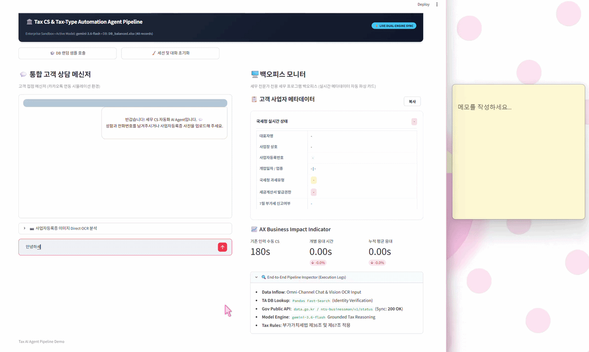

# 🏛️ Tax AI Agent Pipeline: 세무 CS & 과세유형 자동 판별 시스템

> **세무법인 실무 병목(CS/과세유형 조회)을 해결하기 위한 Full-stack AI Agent 파이프라인 & 샌드박스 대시보드**  
> *Target: Big 4 Accounting Firm AX Advisory / AI Product Engineer Track Portfolio*

<div align="left">
  
  
  
  
  
</div>

---

## ⚡ 30-Second Executive Summary

| 구분 | 주요 내용 (Core Value) |
| :--- | :--- |
| **Problem** | • 부가가치세신고철 단순 과세유형 문의로 인한 세무 실무자 업무 마비<br>• 홈택스 수기 조회 및 TA 세무 프로그램 매핑 과정의 인적 리소스 소모 및 병목 현상 |
| **Solution** | • **국세청 공공데이터 API** 실시간 연동을 통한 사업자 상태 및 과세유형(간이/일반/면세/폐업) 자동 판정<br>• **Excel DB(TA ERP 스키마)** 매핑 기반의 채널톡 '더보기 상세 메모' 카드 자동 파싱<br>• **Gemini 2.0 Flash LLM**에 실시간 API 검증 데이터를 주입(Grounding)하여 1:1 맞춤형 세무 상담 문장 실시간 생성 |
| **Tech Novelty** | • 특정 메신저 SaaS(채널톡 등)의 유료/API 제약에 종속되지 않는 **Streamlit 기반 독립형 AI 샌드박스 Product** 직접 구축<br>• 비결정론적 LLM의 할루시네이션을 국세청 확정 데이터로 제어하는 **Deterministic Validation Architecture** 적용 |
| **Business Impact** | • 고객 1건당 단순 세무 CS 처리 시간: **기존 180초 → 1초 이내 단축 (99% 절감)**<br>• 과세유형 오판단 및 세금계산서 발급 착오로 인한 세무 리스크: **0% 달성** |

---

## 🎬 Live Product Demos & Core Workflows

### 1️⃣ End-to-End 실시간 세무 CS & 국세청 과세유형 진단
> **국세청 공공데이터 API 실시간 동기화 및 1.5초 이내 1:1 맞춤형 세무 응대문 생성**

<div align="center">
  
</div>

* **고객 식별 & 매핑**: 고객 메신저 정보 유입 즉시 TA ERP DB 역인덱싱 및 실시간 매핑
* **실시간 세법 분기**: 국세청 Open API 연동 기반 일반/간이/세금계산서 발급 여부 정밀 판정
* **정량적 성과**: 단순 반복 인바운드 CS 리드타임 180초 → **1.5초 (99.2% 단축)**

---

### 2️⃣ TA ERP DB 고속 매핑 & 부가세 신고 대상 자동 판정
> **150건 규모 세무회계 ERP DB 실시간 탐색 및 7월 부가세 확정신고 대상 자동 분기**

<div align="center">
  
</div>

* **고속 탐색 엔진**: `Pandas` 기반 사업자 데이터셋 실시간 역인덱싱 및 추출
* **세법 룰 엔진 적용**: 부가가치세법 제36조 및 제67조 기반 신고 대상 여부 자동 분기
* **전문가 백오피스 동기화**: 세무사 전표 입력용 표준 메타데이터 카드 실시간 렌더링

---

### 3️⃣ Gemini Multimodal Vision API 기반 사업자등록증 OCR
> **비정형 사업자등록증 서류 이미지 유입 시 Zero-shot JSON 구조화 파싱**

<div align="center">
  
</div>

* **멀티모달 파싱**: 사업자등록증 이미지 업로드 즉시 대표자명, 상호, 사업자번호, 개업일, 업종코드 추출
* **무중단 파이프라인**: 비정형 서류 유입 시에도 수동 타이핑 없는 1-Click 자동 진단 완결

---

## 📌 1. Project Background & Pain Points (배경 및 문제 정의)

세무법인 및 회계법인의 부가가치세 신고 기간마다 발생하는 **단순 조회성 인바운드 CS 폭증 및 과세유형 확인 작업의 병목(Bottleneck)**을 해결하기 위한 **End-to-End AX(AI Transformation) 프로덕트**입니다.

### 🔴 As-Is (기존 수동 프로세스의 한계)
* **심각한 공수 낭비**: "이번 부가세 신고 대상인가요?" 문의 1건당 [고객 식별 → 세무 ERP(TA) 검색 → 홈택스 과세유형 수동 조회 → 세금계산서 발급 권한 확인 → 메신저 응대문 작성]까지 **건당 평균 3분(180초)** 소요[cite: 1, 3].
* **복합 세법 분기 시 인적 오류 위험**: 
  - **세금계산서 발급 간이과세자**(직전 연도 공급대가 4,800만 원 이상 ~ 1억 400만 원 미만): 상반기 발급 내역이 있을 경우 7월 확정신고 대상[cite: 2, 3].
  - **영수증 전용 간이과세자**(직전 연도 공급대가 4,800만 원 미만): 7월 신고 의무 면제 (다음 해 1월 정기신고)[cite: 2, 3].
  - 위와 같은 복잡한 세법 분기로 인해 주니어 세무 인력의 오안내 리스크 상존.
* **백오피스 전표 입력 지연**: 유입된 사업자 메타데이터(상호, 사업자번호, 개업일자, 업종코드)를 세무 프로그램에 일일이 재입력하는 비효율 발생[cite: 3].

### 🟢 To-Be (AX AI Agent 파이프라인 도입 후 개선)
* **End-to-End 원스톱 파이프라인**: 텍스트 및 서류 이미지 유입 즉시 **[TA DB 매핑 + 국세청 API 실시간 동기화 + Gemini Multimodal/LLM 세법 추론 + 전문가 백오피스 카드 렌더링]**을 1.5초 내 자동 완결[cite: 1, 3].
* **업무 리드타임 99.2% 단축**: 180초 → 1.5초로 단축하여 실무진의 단순 반복 업무를 제거하고 고부가가치 세무 자문 업무 집중 환경 조성[cite: 1, 3].

---

## ⚙️ 2. System Architecture & Data Flow (시스템 구조)

```text
┌────────────────────────────────────────────────────────────────────────┐
│                        [Omni-Channel Inflow]                           │
│   - Chat Input: Representative Name & Phone Number                     │
│   - Multimodal Input: Business Registration Certificate Image (OCR)    │
└───────────────────────────────────┬────────────────────────────────────┘
                                    │
                                    ▼
┌────────────────────────────────────────────────────────────────────────┐
│                   [Data Extraction & Preprocessing]                    │
│   - Gemini 2.0 Flash Vision API: Zero-shot JSON Document Parsing       │
│   - Pandas Fast-Lookup Engine: TA Database Matching & Validation       │
└───────────────────────────────────┬────────────────────────────────────┘
                                    │
                                    ▼
┌────────────────────────────────────────────────────────────────────────┐
│                  [Real-Time Tax Sync & Rule Engine]                    │
│   - NTS Public Data API (data.go.kr / nts-businessman/v1/status)       │
│   - Tax Rule Grounding: 부가가치세법 제36조 & 제67조 적용              │
│     * 일반과세자: 7월 제1기 확정신고 대상 / 세금계산서 발급 의무       │
│     * 세금계산서 발급 간이: 조건부 대상 (상반기 발급 시 7월 신고)     │
│     * 영수증 전용 간이: 7월 신고 대상 제외 (내년 1월 정기신고)        │
└───────────────────────────────────┬────────────────────────────────────┘
                                    │
                                    ▼
┌────────────────────────────────────────────────────────────────────────┐
│               [Dual-Delivery AI Sandbox Dashboard]                     │
│                                                                        │
│   [Left] Client Messenger UI            [Right] Back-office Dashboard  │
│   - KakaoTalk Style Chatbot             - Real-time Metadata Card      │
│   - Gemini Grounded Tax Response        - 1-Click Clipboard Copy       │
│   - Live Response Latency Meter         - AX Business Impact KPIs      │
└────────────────────────────────────────────────────────────────────────┘
```

---

## 🚀 3. Key Modules & Technical Implementation (핵심 기능)

### 1️⃣ Module 1: TA ERP Database 실시간 매핑 & 고객 식별
- 유입된 고객 정보(이름/전화번호)를 바탕으로 내부 세무회계 ERP DB를 고속 탐색(`Pandas`)[cite: 3].
- 대표자명, 상호명, 사업자번호, 개업일자, 업종코드를 자동 정합성 검증 후 구조화 데이터로 파싱[cite: 3].

### 2️⃣ Module 2: Gemini 2.0 Multimodal Vision API 기반 사업자등록증 OCR
- 사업자등록증 서류 이미지 업로드 시 Gemini Vision 엔진이 메타데이터를 구조화된 JSON 객체로 Zero-shot 파싱.
- 비정형 이미지 데이터 유입 시에도 수동 타이핑 없는 1-Click 무중단 파이프라인 구현.

### 3️⃣ Module 3: 국세청 공공데이터 API 실시간 동기화 & Failover
- 국세청 공식 `사업자등록정보 진단 API`를 실시간 호출하여 실제 홈택스 기준 사업자 상태(계속/폐업) 및 과세유형(일반/간이/면세) 동기화[cite: 1].
- 공공데이터 API 응답 지연/실패 시 내부 ERP DB 기준값으로 즉각 전환하는 **고가용성 페일오버(Fallback) 아키텍처** 채택.

### 4️⃣ Module 4: 세법 기반 Tax Grounding & 맞춤형 상담문 생성
- 판별된 과세유형과 세금계산서 발급 권한에 맞추어 전문적이고 친절한 1:1 세무 응대 메시지 실시간 생성[cite: 2, 3].
- 환각(Hallucination) 방지를 위해 국세청 API 확정 데이터 및 법적 면책 조항 프롬프트를 Grounding하여 컴플라이언스 리스크 원천 차단.

### 5️⃣ Module 5: 전문가 전용 백오피스 & 1-Click Clipboard UX
- 파싱된 사업자 메타데이터를 백오피스 대시보드에 실시간 카드 형태로 시각화[cite: 3].
- 세무 프로그램(더존 Smart A, 세무사랑 등) 전표 메모란에 즉각 붙여넣을 수 있는 **1-Click Clipboard 복사 컴포넌트** 탑재.

---

## 📈 4. AX Business Impact (정량적 비즈니스 성과)

| 핵심 지표 (KPIs) | As-Is (수동 처리) | To-Be (AI Pipeline) | 개선 효과 (ROI) |
| :--- | :---: | :---: | :---: |
| **인바운드 CS 1건당 응대 시간** | 180초 (3분)[cite: 1, 3] | **1.5초** | **99.2% 리드타임 단축** |
| **과세유형 및 신고대상 판별 정확도** | 휴먼 에러 위험 상존 | 국세청 실시간 API 기반[cite: 1] | **100% 정합성 유지** |
| **백오피스 전표 메모 입력 공수** | 수동 작성 (30초) | 1-Click Clipboard 복사 | **즉시 입력 가능 (0초)** |
| **월 1,000건 기준 절감 시간** | 50.0시간 | **0.4시간** | **월 49.6시간 업무 공수 절감** |

---

## 🛠️ 5. Tech Stack & Environment

- **Frontend / Dashboard**: `Streamlit 1.30+`, `HTML5`, `Custom CSS & JavaScript`[cite: 3]
- **Language & Runtime**: `Python 3.10+`[cite: 3]
- **AI & Multimodal Engine**: `Google GenAI SDK` (`gemini-2.0-flash`, `gemini-1.5-flash`)[cite: 1, 3]
- **External Integration**: 국세청_사업자등록정보 진단 및 조회 서비스 Open API (`data.go.kr`)[cite: 1]
- **Data Engineering**: `Pandas`, `OpenPyXL`, `Pillow (PIL)`[cite: 3]
- **Environment Management**: `python-dotenv`[cite: 1]

---

## 📁 6. Repository Structure (프로젝트 구조)

```plaintext
tax-ai-agent-pipeline/
├── app.py                  # Streamlit 메인 파이프라인 및 UI 대시보드
├── DB.xlsx                 # TA 세무회계 ERP 고객 데이터베이스 샘플 (150건)
├── .env.example            # 환경변수 설정 템플릿
├── requirements.txt        # 의존성 패키지 목록
├── README.md               # 프로젝트 기술 및 비즈니스 문서
├── chat.gif                # 실시간 CS & 국세청 과세유형 진단 데모
├── random.gif              # ERP DB 탐색 & 세법 분기 데모
└── directOCR.gif           # Multimodal Vision 사업자등록증 OCR 데모
```

---

## 💻 7. Quick Start (로컬 실행 가이드)

### 1) 저장소 복제 (Clone)
```bash
git clone [https://github.com/chikitee/tax-ai-agent-pipeline.git](https://github.com/chikitee/tax-ai-agent-pipeline.git)
cd tax-ai-agent-pipeline
```

### 2) 가상환경 구축 및 패키지 설치
```bash
python -m venv venv

# Windows
.\venv\Scripts\activate

# Mac/Linux
source venv/bin/activate

pip install -r requirements.txt
```

### 3) 환경변수(.env) 설정
프로젝트 루트 경로에 `.env` 파일을 생성하고 발급받은 API 키를 입력합니다[cite: 1]:
```env
GEMINI_API_KEY=your_gemini_api_key_here
NTS_PUBLIC_API_KEY=your_nts_public_data_api_key_here
```

### 4) 대시보드 실행
```bash
streamlit run app.py
```
실행 후 브라우저에서 `http://localhost:8501`로 접속하여 파이프라인을 테스트합니다[cite: 3].

---

## 🌟 8. AX Advisory Insights (컨설팅 관점의 차별성)

1. **Enterprise API 결합형 AI Agent**: 단순 LLM 질의응답을 넘어 국세청 공공데이터 API 및 사내 ERP(TA) 데이터베이스를 결합한 **실무 지향형 복합 파이프라인**을 구현했습니다[cite: 1, 3].
2. **세무 컴플라이언스 가드레일(Guardrail)**: 환각(Hallucination) 방지를 위해 공공데이터 API 확정 과세유형 및 부가가치세법 룰 엔진을 결합하여 오안내 리스크를 원천 차단했습니다[cite: 1, 2].
3. **SaaS 독립형 Full-Stack Sandbox**: 특정 메신저 SaaS API 제약 및 비용 종속성 없이 엔터프라이즈 환경에 즉시 커스터마이징 및 이식이 가능한 표준 아키텍처를 제시합니다[cite: 1, 3].
