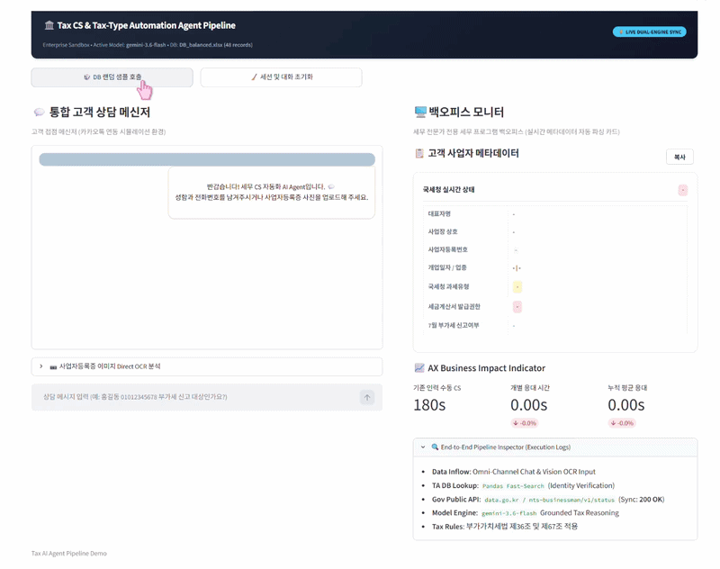
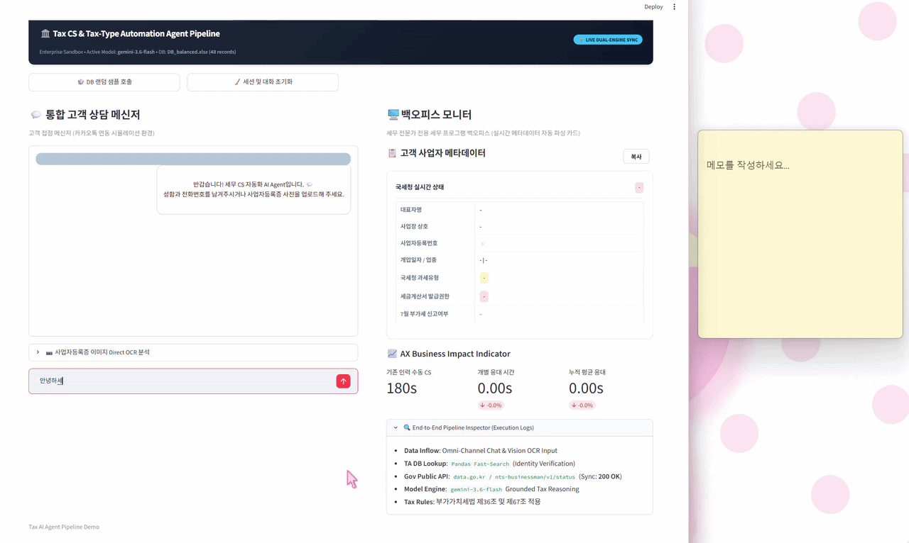
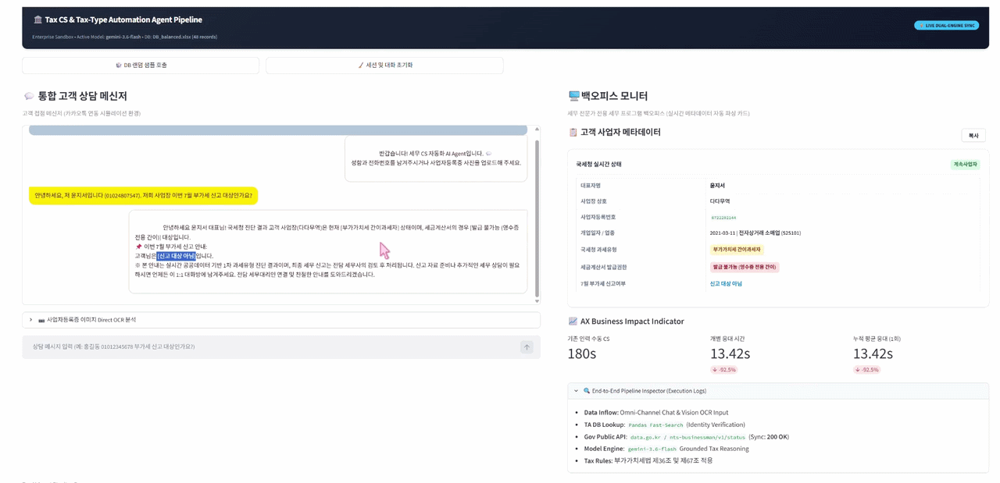
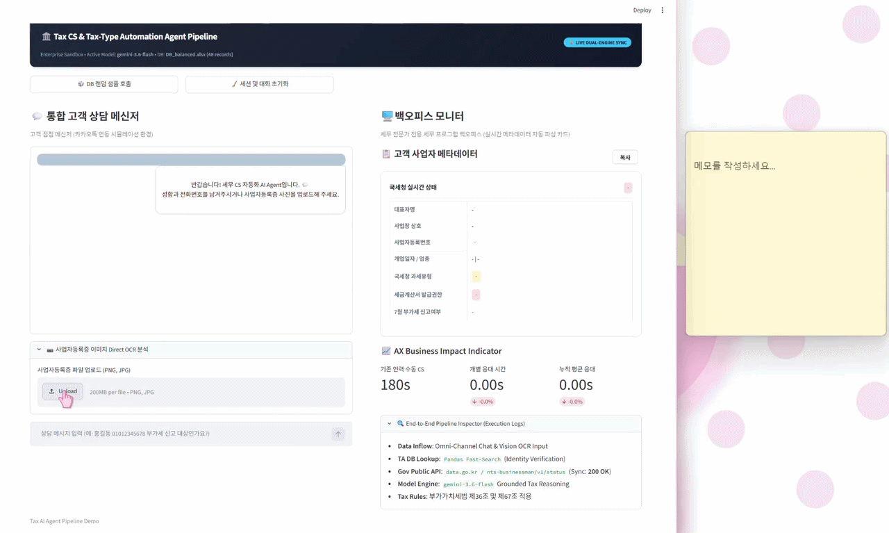

# Tax AI Agent Pipeline

세무법인 부가세 신고 기간에 반복되는 과세유형 문의("이번 7월에 신고해야 하나요?")를 자동으로 처리해 보려고 만든 프로젝트입니다.

고객이 이름과 전화번호를 남기거나 사업자등록증 사진을 올리면

1. 사무소 고객 DB(엑셀)에서 고객을 찾고
2. 국세청 사업자등록 상태조회 API로 사업자 상태와 과세유형을 확인한 뒤
3. 부가가치세법 기준으로 세금계산서 발급 가능 여부와 7월 신고 대상 여부를 판정하고
4. 고객에게 보낼 안내 메시지와 세무 담당자용 정보 카드를 만듭니다.



왼쪽은 고객 상담창, 오른쪽은 세무 담당자가 보는 백오피스 화면입니다.

## 만든 이유

신고철에는 단순 조회 문의가 몰립니다. 문의 1건을 처리하려면 고객 확인, 세무 프로그램(TA) 검색, 홈택스 과세유형 조회, 세금계산서 발급 여부 확인, 답변 작성까지 해야 해서 건당 3분 정도 걸린다고 봤습니다.

특히 간이과세자는 조건에 따라 답이 달라 헷갈리기 쉽습니다.

| 구분 | 직전 연도 공급대가 | 7월 확정신고 |
| --- | --- | --- |
| 세금계산서 발급 간이과세자 | 4,800만 원 이상 ~ 1억 400만 원 미만 | 상반기에 세금계산서를 발급했으면 대상 |
| 영수증 전용 간이과세자 | 4,800만 원 미만 | 대상 아님 (다음 해 1월 정기신고) |

그리고 고객 정보(상호, 사업자번호, 개업일자, 업종)를 세무 프로그램 메모란에 다시 입력하는 것도 번거로운 일이었습니다.

## 처리 흐름

```text
문의 접수 (채팅 또는 사업자등록증 사진)
   ↓
고객 확인
 - 채팅: 전화번호 뒤 8자리로 고객 DB 검색
 - 사진: Gemini로 대표자명, 상호, 사업자번호, 개업일자, 업종 추출
   ↓
국세청 API 조회 (계속/폐업, 과세유형)
 - 조회 실패 시 고객 DB에 저장된 과세유형 사용
   ↓
규칙으로 판정 (세금계산서 발급 여부, 7월 신고 대상 여부)
   ↓
결과 표시
 - 고객용: 상담창 안내 메시지
 - 담당자용: 고객 정보 카드, 복사 버튼, 처리 시간
```

## 판정 규칙

과세유형과 신고 대상 판단은 코드에 정해 둔 규칙으로 합니다.

| 과세유형 / 상태 | 세금계산서 | 7월 부가세 신고 |
| --- | --- | --- |
| 일반과세자 | 발급 가능 | 대상 (제1기 확정신고) |
| 간이과세자 (세금계산서 발급사업자) | 발급 가능 | 조건부 (상반기 발급 시 7월, 아니면 다음 해 1월) |
| 간이과세자 (영수증 전용) | 발급 불가 | 대상 아님 |
| 폐업 | 발급 불가 | 폐업일이 속한 달의 말일부터 25일 이내 폐업 확정신고 |
| 그 외 | 세무사 확인 필요 | 대상으로 안내 |

## LLM 사용 범위

Gemini는 두 군데에서만 씁니다.

- 사업자등록증 사진에서 글자 읽기 (OCR)
- 판정 결과를 정해진 형식의 안내 문장으로 쓰기

과세유형이나 신고 대상 판단은 LLM에 맡기지 않았습니다. 세무 안내가 틀리면 바로 문제가 되기 때문에, LLM에는 이미 판정된 결과만 넘기고 문장 형식도 고정했습니다. Gemini 호출이 실패하면 같은 형식의 기본 문장으로 답합니다. 모든 안내문 끝에는 "1차 진단이며 최종 신고는 담당 세무사 검토 후 처리된다"는 문구가 붙습니다.

## 기능

**채팅 문의**



이름과 전화번호를 입력하면 고객 DB에서 찾아 진단합니다. 전화번호가 없으면 다시 요청합니다.

**DB 랜덤 샘플**



`DB 랜덤 샘플 호출` 버튼으로 고객 한 명을 골라 문의 상황을 재현합니다. 일반과세자, 간이과세자 결과를 빠르게 확인할 때 씁니다.

**사업자등록증 OCR**



사업자등록증 사진(PNG, JPG)을 올리면 정보를 읽어서 같은 진단을 진행합니다.

**백오피스**

- 고객 정보 카드: 국세청 상태, 대표자명, 상호, 사업자번호, 개업일자, 업종, 과세유형, 세금계산서 발급, 7월 신고 여부
- 복사 버튼: 대표자명, 상호, 사업자번호, 개업일자, 업종을 한 번에 복사해서 세무 프로그램(더존 Smart A, 세무사랑 등) 메모란에 붙여 넣기
- 처리 시간: 수동 처리(180초 기준) 대비 이번 응대 시간과 누적 평균

## 효과

| 항목 | 기존 | 적용 후 |
| --- | --- | --- |
| 문의 1건 응대 | 약 180초 | 1.5초 이내 |
| 메모란 입력 | 직접 입력 (약 30초) | 복사 버튼 |
| 월 1,000건 기준 | 약 50시간 | 약 0.4시간 |

기존 180초와 월 1,000건은 실무 경험을 바탕으로 잡은 가정이고, 적용 후 시간은 데모 환경에서 잰 값입니다.

## 기술 스택

- Python 3.10+, Streamlit
- Google Gemini Flash (`gemini-3.6-flash` → `gemini-2.5-flash` → `gemini-2.0-flash` 순으로 사용 가능한 모델 선택)
- 국세청 사업자등록정보 진단 및 조회 서비스 (공공데이터포털)
- Pandas, OpenPyXL, Pillow, python-dotenv

## 파일 구성

```text
app.py              앱 전체 (화면, 조회, 판정, 답변 생성)
DB_balanced.xlsx    시연용 고객 DB 샘플 (48건, TA 형식)
requirements.txt    패키지 목록
.env.example        API 키 설정 예시
*.gif               데모 영상
```

고객 DB는 열 이름이 조금 달라도(`대표자명`/`성명`, `전화번호`/`연락처` 등) 인식하도록 했고, `DB_balanced.xlsx`가 없으면 `DB.xlsx`를 읽습니다.

## 실행 방법

```bash
git clone https://github.com/chikitee/tax-ai-agent-pipeline.git
cd tax-ai-agent-pipeline

python -m venv venv
source venv/bin/activate      # Windows: .\venv\Scripts\activate
pip install -r requirements.txt
```

`.env.example`을 복사해서 `.env`를 만들고 키를 넣습니다.

```env
GEMINI_API_KEY=Gemini API 키 (Google AI Studio)
NTS_PUBLIC_API_KEY=국세청 API 키 (공공데이터포털)
```

키가 없어도 실행은 됩니다. 이 경우 국세청 조회 대신 고객 DB 값으로 판정하고 기본 안내문으로 답합니다.

```bash
streamlit run app.py
```

브라우저에서 `http://localhost:8501`로 접속합니다.

## 한계

- 카카오톡 화면은 실제 연동이 아니라 비슷하게 만든 화면이고, 고객 DB는 48건짜리 샘플입니다.
- 7월 제1기 확정신고 기준으로만 안내합니다. 다른 신고 시기에는 규칙과 문구를 바꿔야 합니다.
- 1차 안내용이라 최종 신고 판단은 담당 세무사가 확인해야 합니다.
